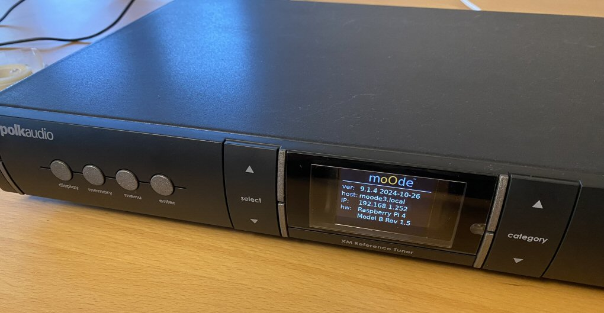

# pi-audio-streamer2
An updated audiophile component Pi music player/streamer using [moOde Audio](https://moodeaudio.org/).



This updated version of the [previous streamer](https://github.com/alanb128/audio-streaming-box) adds a full color display, Pi Pico microcontroller for power management and display switching. See the new video: https://youtu.be/QEAcYsGSqHk?si=DkREA6kypHM_2p7m

This repository is a work in progress, with updates coming regularly - check back again soon!

## Hardware required


## Setup

### Hardware
- Raspberry Pi 4, at least 2GB of RAM
- 2" display: https://www.adafruit.com/product/4311
- "Swirly aluminum" mounting grid: https://www.adafruit.com/product/5781
- Analog Switch (2): https://www.adafruit.com/product/5932
- DAC HAT or digital audio HAT

### Software - Pi
- add the following to `/boot/firmware/config.txt`:
```
dtparam=spi=on
dtoverlay=gpio-shutdown,gpio_pin=14 
```
- In the moode UI, under "Other peripherals" in the "Peripherals" menu, turn on  "LCD updater".
(The LCD update engine runs the lcd-updater.py script whenever UI state changes.
A stub lcd-updater.py script is located in the /var/local/www/commandw/ directory. It also originally updated ~/lcd.txt via /var/local/www/currentsong.txt but has since been removed.)

- SSH into your Moode Pi (Using the username/password entered when flashing the SD card) - You can use the convenient "Web SSH" in the "Security" section of the "System" page in moOde
  
- Install Docker on the pi: https://raspberrytips.com/docker-on-raspberry-pi/ - make sure it starts automatically
  
- Clone this repo to ~ on device
  
- Update /var/local/www/commandw/lcd_updater.py with the included modified file.
  
- Issue docker compose up -d to start the container. It should always load on its own going forward.

### Software - Pico

- install [CircuitPython](https://circuitpython.org/)
  
- Install libraries for busio, terminalio, displayio, digitalio, and adafruit_adg72x

- add the pico.py file as the code.py file to run as default on the Pico
